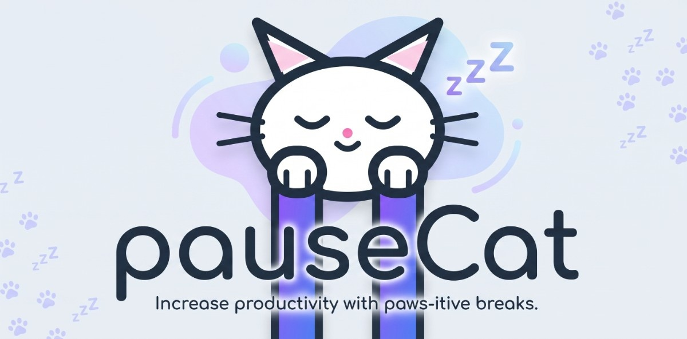
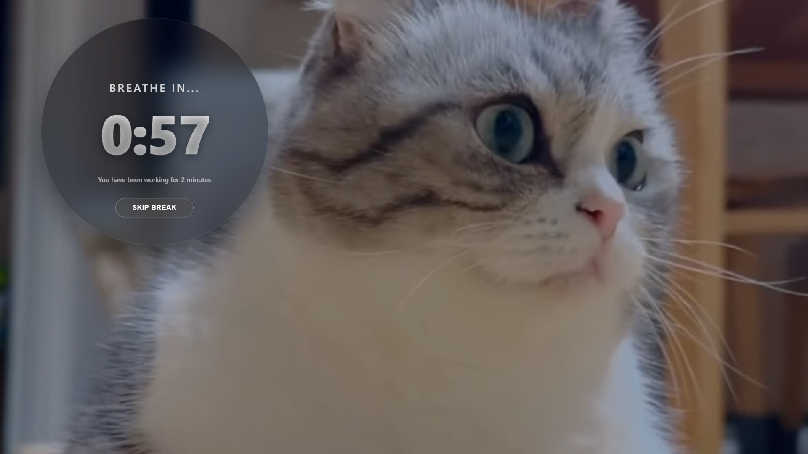
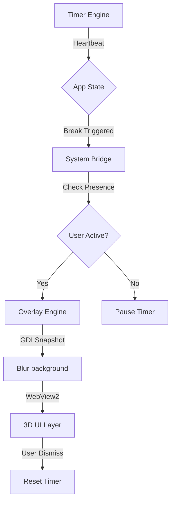
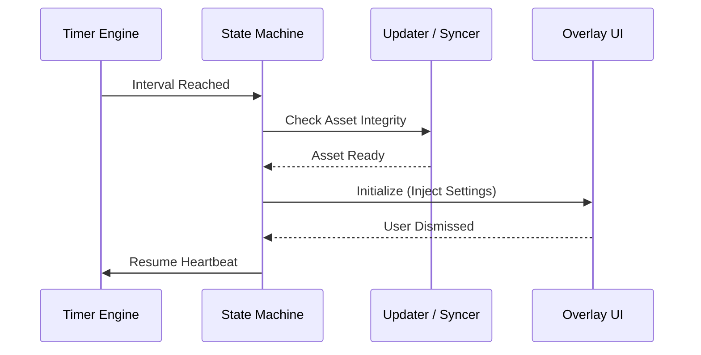

<div align="center">
  

  # PauseCat
  **The High-Performance, SaaS-Grade Break Reminder for Windows.**  
  [](https://github.com/0xarchit/pauseCat/releases)
  [](https://github.com/0xarchit/pauseCat/actions)
  [](https://github.com/0xarchit/pauseCat/releases)  
  [](LICENSE)
  [](https://rust-lang.org)
  
  ---
</div>

## Overview

PauseCat is a professional-grade Windows utility engineered in Rust and powered by WebView2 to provide a seamless, non-intrusive break experience. Designed for high-performance workstations, it ensures consistent health intervals without interrupting productivity with inefficient or flickering overlays.

<div align="center">
  
  <br>
  <em>The immersive break interface.</em>
</div>

---

## Key Features

### Advanced Visual Engine
- **High-Fidelity Overlays:** Utilizes a GDI-based screen capture and pure Rust Gaussian blur implementation for instantaneous, flicker-free break transitions.
- **Glassmorphic UI:** Hardware-accelerated WebView2 host providing a modern, semi-transparent interface with smooth animations and interactive components.
- **Native UX Hardening:** Comprehensive protection against accidental gestures and system-level input interference to maintain application focus.

### Intelligent System Integration
- **Session Awareness:** Monitors Windows Terminal Services (WTS) notifications to detect session locks, unlocks, and system sleep states, automatically pausing and resuming the timer.
- **Media Control Synchronization:** Integration with System Media Transport Controls (SMTC) to intelligently manage background media playback during active break sessions.
- **Theme Synchronization:** Real-time synchronization with Windows system theme preferences for a cohesive desktop experience.

### Technical Excellence
- **Optimized Performance:** Low-overhead Rust implementation resulting in a minimal memory footprint and a compact binary size of less than 2.5 MB.
- **Reliable State Management:** Event-driven architecture powered by a central state machine to ensure consistent behavior across complex system events.
- **Automated Update Pipeline:** Integrated update engine for secure version management and automated deployment via GitHub Releases.
- **Robust Input Validation:** Enforced configuration limits and sanitization for work and break durations to ensure application stability.

---

## Architectural Overview

### System Workflow


### Component Interaction


---

## Project Structure

```text
pauseCat/
├── assets/             # HTML/CSS UI and static assets
├── src/
│   ├── app.rs          # Core application state machine
│   ├── events.rs       # Internal event definitions
│   ├── main.rs         # Entry point and Win32 loop
│   ├── settings.rs     # Persistence and configuration
│   ├── system.rs       # Win32 system hooks (Media, Theme, Presence)
│   ├── timer.rs        # Interruptible high-fidelity heartbeat
│   ├── tray.rs         # System tray and notification handler
│   ├── updater.rs      # GitHub API client and asset syncer
│   └── overlay/
│       ├── blur.rs     # Gaussian blur implementation
│       ├── capture.rs  # GDI BitBlt screen capture
│       └── webview.rs  # WebView2 host and resource injection
├── tests/              # Integration and unit test suite
└── wix/                # WiX Toolset installer configuration
```


---

## Development Workflow

### Prerequisites
- Rust 1.94+
- WebView2 Runtime
- WiX Toolset v4+ (for installer builds)
- UPX (for binary compression)

### Local Setup
1. Clone the repository:
   ```bash
   git clone https://github.com/0xarchit/pauseCat.git
   cd pauseCat
   ```

2. Run in development mode:
   ```bash
   cargo run
   ```

3. Execute the test suite:
   ```bash
   cargo test
   ```

### Building for Release
The release pipeline uses advanced link-time optimizations and binary compression.
```powershell
# Optimized build with UPX
$env:RUSTFLAGS="-C link-arg=/OPT:REF -C link-arg=/OPT:ICF -C link-arg=/INCREMENTAL:NO"
cargo build --release
upx --best --lzma target\release\pausecat.exe

# Build MSI
wix build wix\main.wxs -ext WixToolset.UI.wixext -ext WixToolset.Util.wixext -o target\release\PauseCat_Installer.msi
```

---

### Git Policy
- **Feature Isolation:** One branch per feature: `feature/<description>` or `fix/<description>`.
- **Conventional Commits:** Use `feat:`, `fix:`, `refactor:`, `chore:`, `test:`.
- **Main is Read-Only:** Never commit directly to `main`.

---

## Installation

1. Download the latest `PauseCat_Installer.msi` from the [Releases](https://github.com/0xarchit/pauseCat/releases) page.
2. The WiX installer handles everything: installation, autostart registry, and WebView2 runtime checks.
3. Once installed, PauseCat lives in your System Tray.

---

## Contributing

We welcome contributions! Please see our [CONTRIBUTING.md](.github/CONTRIBUTING.md) and [CODE_OF_CONDUCT.md](.github/CODE_OF_CONDUCT.md) for details.

---
<div align="center">
  Built with ❤️ in Rust for a healthier digital life.
</div>
